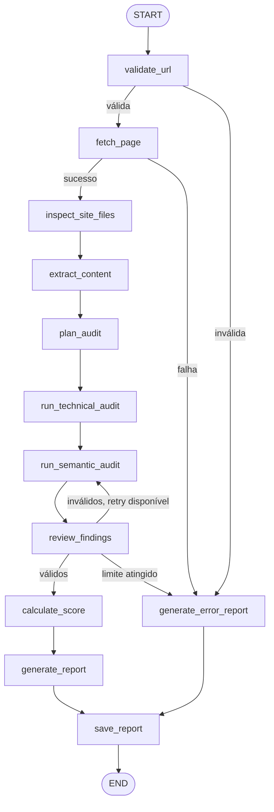

# GEO Inspector

GEO Inspector é um MVP acadêmico que recebe a URL pública de uma página web e gera uma auditoria heurística de prontidão para GEO (Generative Engine Optimization). A ferramenta combina verificações técnicas determinísticas, auditoria semântica com LLM, revisão de achados, pontuação por código e geração de relatório em JSON e Markdown.

O projeto não promete citação, indexação, recomendação ou posicionamento em ChatGPT, Gemini, Perplexity, Google AI Mode, mecanismos de busca ou qualquer sistema generativo. A pontuação é uma heurística criada para o mini-projeto.

## Problema

Muitas páginas são produzidas para SEO tradicional, mas não deixam claro para pessoas e sistemas automatizados qual é o assunto principal, quem é responsável pelo conteúdo, quais evidências sustentam as afirmações e como os dados podem ser extraídos. A avaliação manual desses pontos exige conhecimento técnico e editorial.

## Objetivo

Automatizar uma auditoria de uma única URL por execução, gerando recomendações verificáveis para proprietários de sites, desenvolvedores e produtores de conteúdo.

Entrada:

```json
{"url": "https://exemplo.com/artigo"}
```

Saída:

- relatório estruturado com status, pontuação, classificação, resumo, achados, evidências, recomendações e limitações;
- arquivos `outputs/{execution_id}.json` e `outputs/{execution_id}.md`;
- visualização simples pela interface web.

## Arquitetura



O agente usa `StateGraph` do LangGraph, estado compartilhado tipado em `app/state.py` e `MemorySaver` como checkpointer simples para demonstrar memória/contexto durante a execução.

## Estado Compartilhado

O estado mantém URL normalizada, `execution_id`, resposta HTTP, redirects, HTML, texto extraído, metadados, `robots.txt`, sitemap, plano de auditoria, achados técnicos, achados semânticos, erros de validação, retry, pontuação e relatório final. O estado não armazena chaves, tokens ou credenciais.

## Planner

O nó `plan_audit` classifica a página deterministicamente como artigo, página institucional, produto, landing page, documentação técnica, conteúdo insuficiente ou tipo não identificado. O planner seleciona apenas módulos permitidos e não permite que a LLM crie ferramentas ou altere o fluxo.

## Ferramentas

- `fetch_webpage`: usa HTTPX, User-Agent identificável, timeout, limite de bytes, redirects manuais e validação de conteúdo HTML.
- `inspect_site_files`: consulta `robots.txt`, lê `Sitemap:` e tenta `/sitemap.xml` sem iniciar crawling.
- `extract_page_data`: extrai title, description, canonical, robots, idioma, headings, autor, datas, links, imagens, JSON-LD, tipos Schema.org, tags semânticas e conteúdo principal.
- `save_report`: salva JSON e Markdown em `outputs/` com `execution_id` gerado internamente.

## Reviewer

O reviewer valida schema, evidência, recomendação, categorias, status, prioridade, confiança, duplicações e quantidade mínima de achados semânticos. Quando a auditoria semântica falha por schema, o grafo executa no máximo uma nova tentativa. Erros de configuração de LLM geram relatório de erro sem simular chamada real.

## Pontuação GEO

A pontuação é calculada por código em `app/services/scoring.py`.

| Categoria | Peso |
| --- | ---: |
| Rastreabilidade e acesso | 20 |
| Estrutura técnica e semântica | 15 |
| Clareza e capacidade de resposta | 25 |
| Autoridade e confiabilidade | 20 |
| Evidências, fontes e citabilidade | 20 |

Conversão:

- `passed`: 100% dos pontos do critério;
- `warning`: 50%;
- `failed`: 0%;
- `not_verified`: 0%;
- `not_applicable`: removido do denominador da categoria.

Classificação:

- 0-39: Baixa prontidão;
- 40-59: Prontidão limitada;
- 60-79: Prontidão moderada;
- 80-100: Boa prontidão.

## Segurança

As URLs são tratadas como entrada não confiável. O MVP implementa proteção contra SSRF com:

- apenas `http` e `https`;
- bloqueio de URL sem hostname e credenciais embutidas;
- bloqueio de `localhost`, hostnames de metadata e IPs privados, loopback, link-local, reservados, multicast e não especificados;
- resolução DNS antes da requisição;
- validação de todos os IPs resolvidos;
- suporte a IPv4 e IPv6;
- revalidação de cada redirecionamento;
- limite de redirecionamentos, timeout e bytes;
- aceitação apenas de `text/html` e `application/xhtml+xml` para páginas.

Essa proteção é adequada para o MVP, mas não representa proteção absoluta contra todas as formas possíveis de DNS rebinding.

## Prompt Injection

O conteúdo da página é sempre tratado como dado não confiável. O prompt semântico declara que instruções encontradas na página devem ser ignoradas, que a página não pode alterar o papel do modelo, schema, ferramentas, segredos ou regras da aplicação, e que nenhuma ação deve ser executada por ordem do conteúdo analisado. A fixture `tests/fixtures/prompt_injection.html` cobre esse cenário.

## Instalação

Windows PowerShell:

```powershell
Set-Location "D:\SCTEC\Mini-Projeto-Avaliativo-2\geo-inspector"

py -m venv .venv

.\.venv\Scripts\Activate.ps1

python -m pip install --upgrade pip

pip install -r requirements.txt

pip install -r requirements-dev.txt
```

## Configuração

Crie um `.env` local a partir de `.env.example`. Não versione o `.env`.

```text
LLM_PROVIDER=openai
OPENAI_API_KEY=...
MODEL_NAME=...
```

ou:

```text
LLM_PROVIDER=google
GOOGLE_API_KEY=...
MODEL_NAME=...
```

Se nenhuma chave válida estiver configurada, a aplicação preserva achados técnicos já produzidos e retorna erro compreensível de configuração, sem fingir uma chamada real.

## Execução

```powershell
uvicorn app.main:app --reload
```

Acesse:

```text
http://127.0.0.1:8000/
```

## Endpoints

- `GET /health`
- `POST /api/v1/audits`
- `GET /api/v1/reports/{execution_id}`
- `GET /api/v1/reports/{execution_id}/download?format=json`
- `GET /api/v1/reports/{execution_id}/download?format=markdown`

Códigos esperados:

- `200`: auditoria concluída;
- `400`: URL inválida ou destino bloqueado;
- `422`: corpo malformado;
- `502`: falha ao acessar a página;
- `500`: falha interna ou LLM não configurada.

## Interface

O frontend fica em `frontend/` e é servido pelo FastAPI. Ele possui campo de URL, botão de auditoria, indicador de processamento, erros amigáveis, nota, classificação, resumo, achados, pontuação por categoria e links para download. O JavaScript usa `textContent` e criação de nós DOM para evitar inserir HTML analisado via `innerHTML`.

## Testes

```powershell
python -m pytest -q
python -m ruff check .
```

Os testes usam fixtures locais, `httpx.MockTransport` e `FakeLLMProvider`, sem depender de credenciais reais nem exclusivamente da internet.

## Exemplos

Veja:

- `examples/sample-report.json`
- `examples/sample-report.md`
- `docs/examples.md`

Os exemplos versionados são demonstrativos e baseados em fixture local; não representam auditoria real executada na internet.

## Estrutura

```text
app/
  api/
  nodes/
  prompts/
  schemas/
  services/
  tools/
frontend/
tests/
docs/
examples/
outputs/
slides/
```

## Decisões Técnicas

- HTML estático é coletado sem executar JavaScript.
- O planner é determinístico para reduzir risco de ampliação de escopo pela LLM.
- A LLM avalia apenas aspectos semânticos e recebe contexto limitado.
- A pontuação final é calculada somente por código.
- Relatórios JSON e Markdown são gerados a partir do mesmo objeto Pydantic.
- A persistência do MVP é baseada em arquivos, sem banco de dados.

## Limitações

- GEO é uma área em evolução.
- A pontuação é heurística.
- Não há garantia de citação ou posicionamento.
- A análise de uma página não representa todo o domínio.
- Páginas dependentes de JavaScript podem ser analisadas parcialmente.
- Resultados semânticos podem variar conforme modelo e provedor.
- Ausência detectada não comprova inexistência absoluta.
- Originalidade não é verificada por comparação externa.

## Melhorias Futuras

- Comparação entre auditorias da mesma URL.
- Exportação adicional em PDF.
- Suporte opcional a crawling limitado.
- Melhor visualização histórica.
- Integração com observabilidade para auditorias longas.
