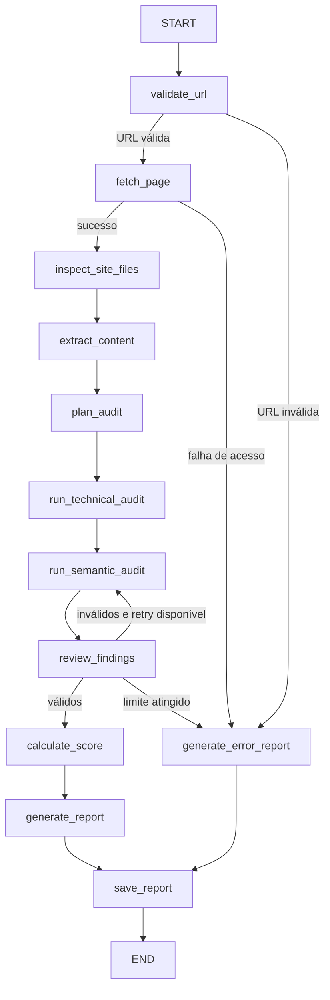

# Arquitetura

O GEO Inspector usa FastAPI para API/interface e LangGraph para controlar o fluxo do agente. O MVP executa uma auditoria por URL, sem crawler de domínio e sem execução de JavaScript.

## Grafo

## Responsabilidades dos Módulos

- `app/main.py`: cria o app FastAPI, configura logging, frontend e grafo.
- `app/api/routes.py`: expõe endpoints de auditoria, leitura e download de relatórios.
- `app/graph.py`: monta o `StateGraph`, rotas condicionais e `MemorySaver`.
- `app/state.py`: define o estado compartilhado.
- `app/tools/safe_http.py`: valida URL, bloqueia destinos inseguros e faz fetch com redirects manuais.
- `app/tools/site_files.py`: consulta `robots.txt` e sitemaps.
- `app/tools/page_extractor.py`: extrai metadados e conteúdo principal com BeautifulSoup.
- `app/tools/report_writer.py`: salva e carrega relatórios sem usar caminhos do usuário.
- `app/nodes/*`: implementa nós do grafo.
- `app/services/llm_factory.py`: abstrai provedores OpenAI, Google e fake injetável para testes.
- `app/services/scoring.py`: calcula pontuação determinística.
- `app/schemas/*`: valida entrada, achados e relatórios com Pydantic.

## Fluxo dos Dados

1. A API cria um `execution_id` interno.
2. `validate_url` normaliza a URL e bloqueia entradas inseguras.
3. `fetch_page` coleta HTML com HTTPX, limite de bytes, timeout e redirects revalidados.
4. `inspect_site_files` consulta `robots.txt` e sitemaps sem interromper a auditoria se não houver sitemap.
5. `extract_content` remove elementos irrelevantes e extrai metadados, texto, links, imagens e JSON-LD.
6. `plan_audit` classifica a página e seleciona módulos permitidos.
7. `run_technical_audit` gera achados determinísticos com evidência observável.
8. `run_semantic_audit` chama o provedor configurado e valida saída estruturada.
9. `review_findings` revisa schema, duplicações e consistência.
10. `calculate_score` aplica pesos fixos.
11. `generate_report` cria um objeto `AuditReport`.
12. `save_report` grava JSON e Markdown.

## Rotas Condicionais

- URL inválida ou destino bloqueado: `validate_url -> generate_error_report`.
- Falha de acesso HTTP: `fetch_page -> generate_error_report`.
- Achados semânticos inválidos: `review_findings -> run_semantic_audit`, uma única vez.
- Segunda falha de validação: `review_findings -> generate_error_report`.

## Código Determinístico e LLM

O código verifica status HTTP, redirects, content type, title, description, canonical, `noindex`, robots, sitemap, headings, idioma, autoria, datas, links, imagens, JSON-LD, tamanho do texto e elementos semânticos.

A LLM avalia clareza, respostas diretas, organização, utilidade, especificidade, autoridade percebida, transparência editorial, evidências, fontes e citabilidade. A LLM não escolhe a pontuação final.

## Memória

O grafo é compilado com `MemorySaver`. Cada execução usa o `execution_id` como `thread_id`, preservando o estado compartilhado durante o fluxo e demonstrando contexto entre nós e retry semântico.
